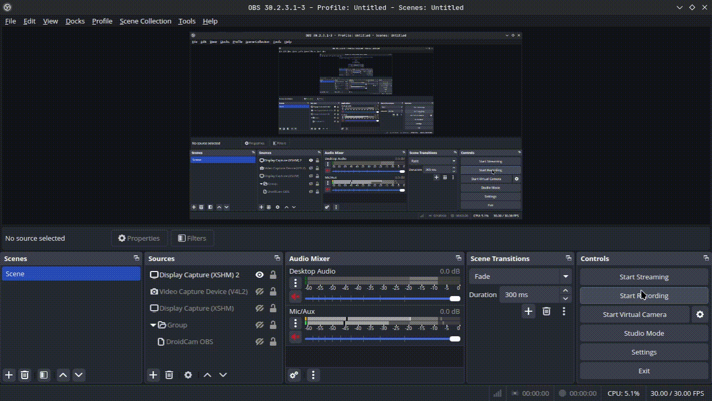

# Chmod X Run

Right-click any `.sh` or `.bash` file to make it executable and run it — no manual `chmod +x` or terminal typing required.

## Features

- **Mark as Executable** — adds the execute bit (`chmod +x`) to the selected shell script directly from the Explorer context menu.
- **Run** — runs the script in the VS Code integrated terminal, so you can see live output and interact with it if needed.
- **Run Silently** — runs the script in the background via a child process (working directory set to the script's own folder), showing a progress notification and a success/error message when it finishes — no terminal window needed.
- After marking a file executable, you're prompted to immediately **Run** or **Run Silently** it, so the whole "chmod → run" flow takes one right-click and one click.

Both context menu entries only appear on files with a `.sh` extension, so your Explorer menu stays clean.

## Usage

1. Right-click a `.sh` file in the Explorer.
2. Choose **Mark as Executable** to set the execute bit.
   - You'll get a notification with **Run** and **Run Silently** buttons.
3. Or choose **Run** / **Run Silently** directly if the file is already executable.

| Command                           | What it does                                                                  |
| --------------------------------- | ----------------------------------------------------------------------------- |
| `Chmod X Run: Mark as Executable` | Sets the execute permission bit on the file                                   |
| `Chmod X Run: Run`                | Runs the script in the integrated terminal                                    |
| `Chmod X Run: Run Silently`       | Runs the script via a background process with progress + result notifications |

## Requirements

- macOS or Linux, or Windows with a Unix-like environment (WSL, Git Bash) where the execute bit and shebang lines are meaningful.
- No external dependencies — uses Node's built-in `fs` and `child_process` modules.

## Extension Settings

This extension currently contributes no configurable settings.

## Known Issues

- On native Windows without WSL/Git Bash, running `.sh` files has no meaningful shell to execute in.

---

**Enjoy!**
